## recipe-front-with-TanstackRouter

このリポジトリは、レシピアプリのフロントエンド部分です。今回は、Reactとファイルベースのルーティングを使え、型が安全でもあるTanstack Routeを使って開発しました。

URLは https://web.arrange-cook.work です

## アプリの概要
アレンジレシピを投稿することを目的としたアプリです。

このアプリを作った目的は、私が短い時間で美味しいものを食べたいと感じることが多いからです。私自身、料理を早く食べたいので、コンビニで売っているもので済ませてしまうことが多いのですが、そのような食生活を続けてしまうと段々同じようなものを食べてことになり、飽きてしまっていました。これを解決するために、一手間を加えたレシピを共有するアプリを作ろうと思って開発しました。

## アプリの機能

このアレンジレシピアプリには、ユーザーがさまざまな操作を行える複数の機能が含まれています。基本的な機能としては以下のものがあります。

### レシピに関する機能
- **レシピの取得**: 全てのユーザーが、他のユーザーが投稿したレシピを閲覧することができます。
  
  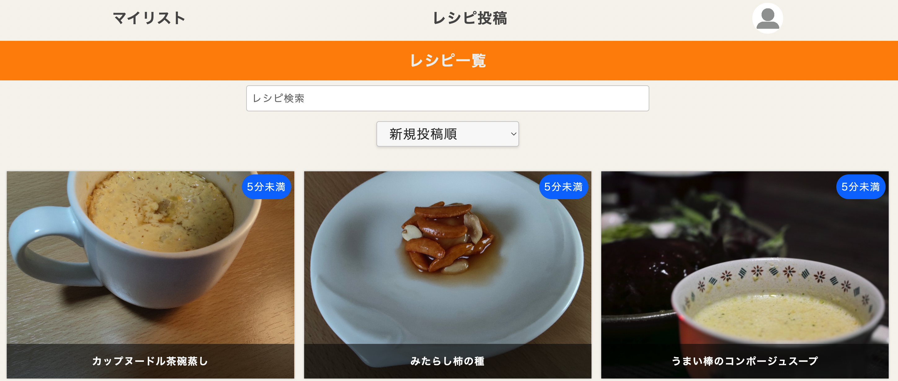

- **レシピの投稿**: ログインユーザーのみが新しいレシピを投稿することが可能です。
  
  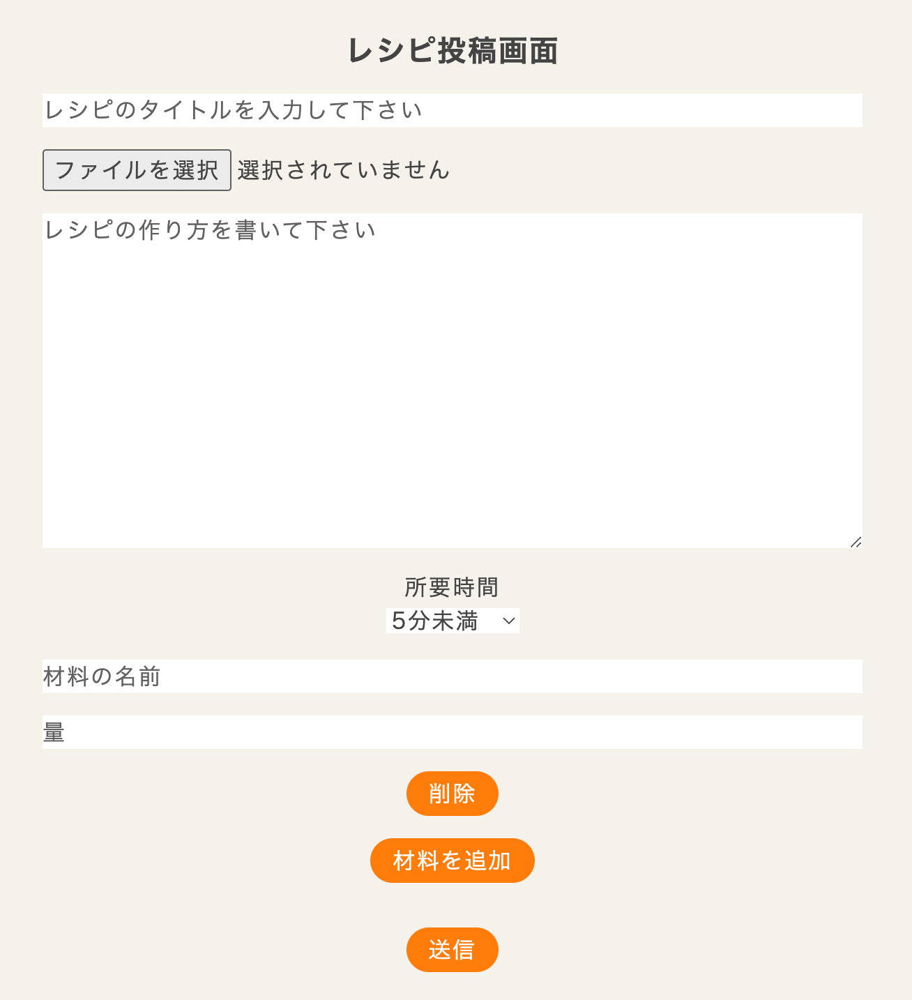

- **レシピの詳細情報**: ログインユーザーのみが新しいレシピを投稿することが可能です。レシピの詳細を表示した際、アクセスしたユーザーがそのレシピの投稿者と同じならば、削除ボタンと編集ボタンが表示されます。

  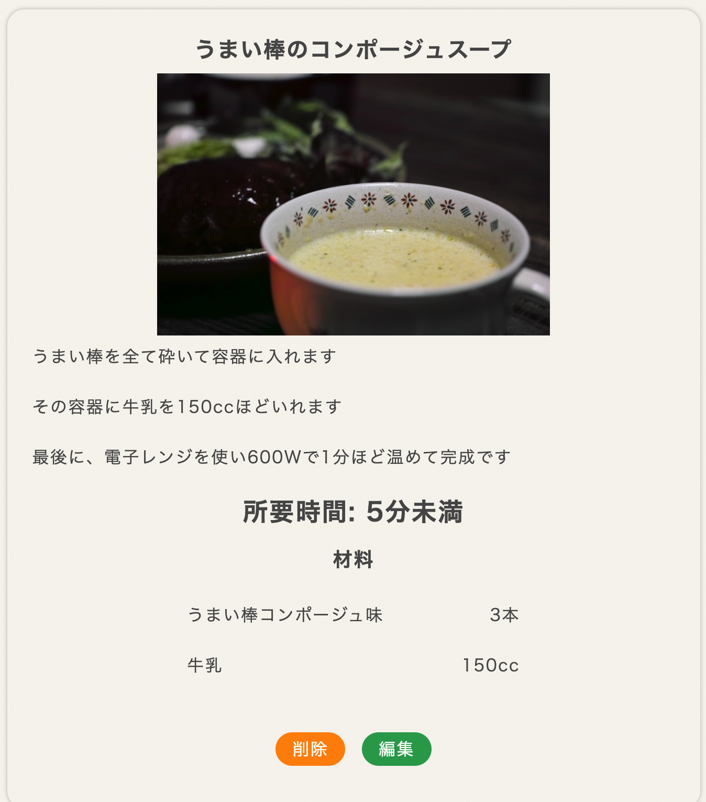

- **レシピの削除**: 上記の画面で削除ボタンを押すと、確認ダイアログが表示され、「OK」を押すと、削除され、ルートパスへ戻されます。

   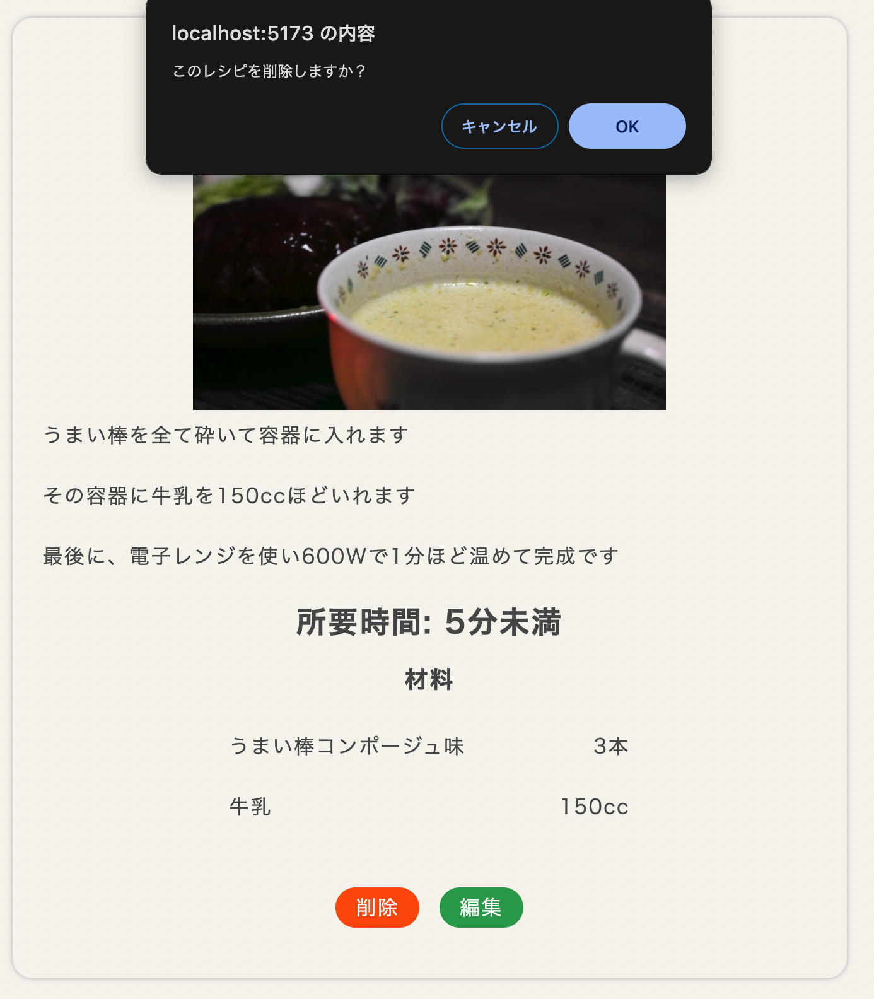

- **レシピの編集**: 自分が投稿したレシピに限り、そのレシピを編集することができます。
  
  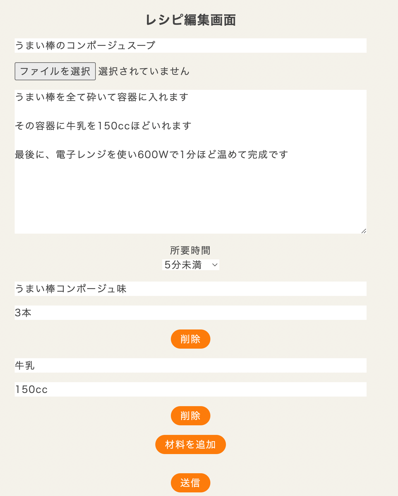

### フォロー機能
- **フォロー**: レシピの詳細画面で、アクセスしたユーザーとそのレシピを投稿したユーザーが異なる場合、そのレシピの投稿者をフォローすることができます。
  
  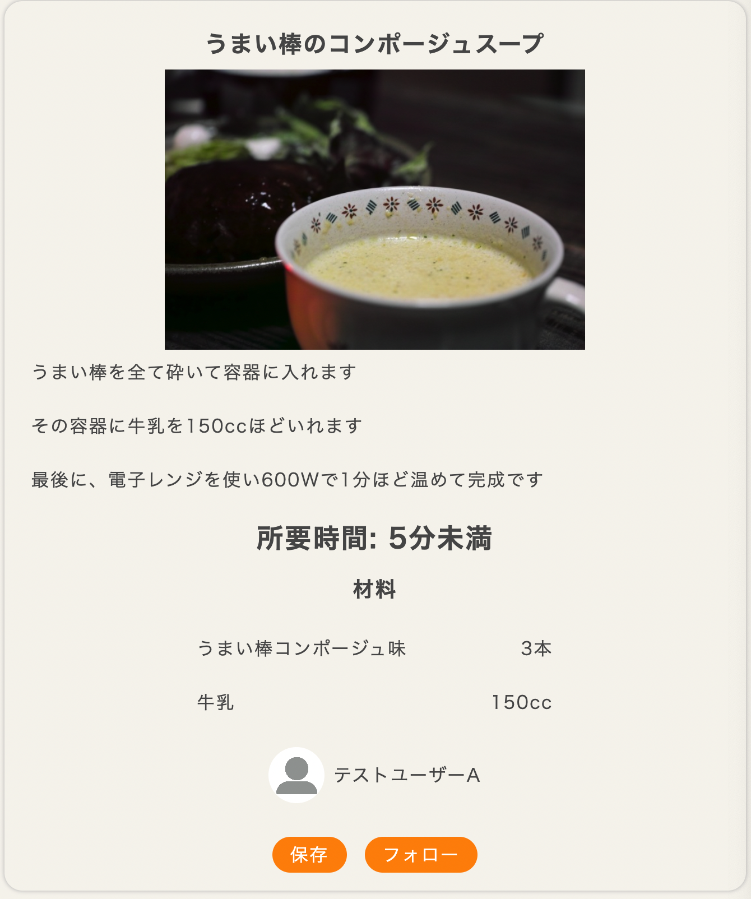

- **フォロー解除**: 一度フォローしたユーザーをフォロー解除することもできます。下記の画像をよく見ると、フォローボタンからフォロー解除ボタンにUIが更新されていることがわかります。
  
  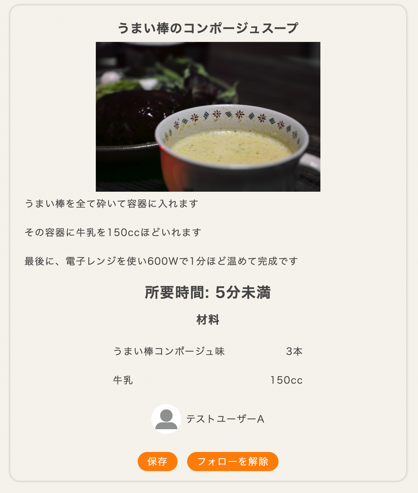

- **フォロー中のユーザー一覧**: ヘッダーのアバター部分をクリックし、「フォロー中」という箇所をクリックすると、自分がフォローしているユーザーの一覧を閲覧できます。
  
  ヘッダーのアバター部分をクリックした際のモーダル

  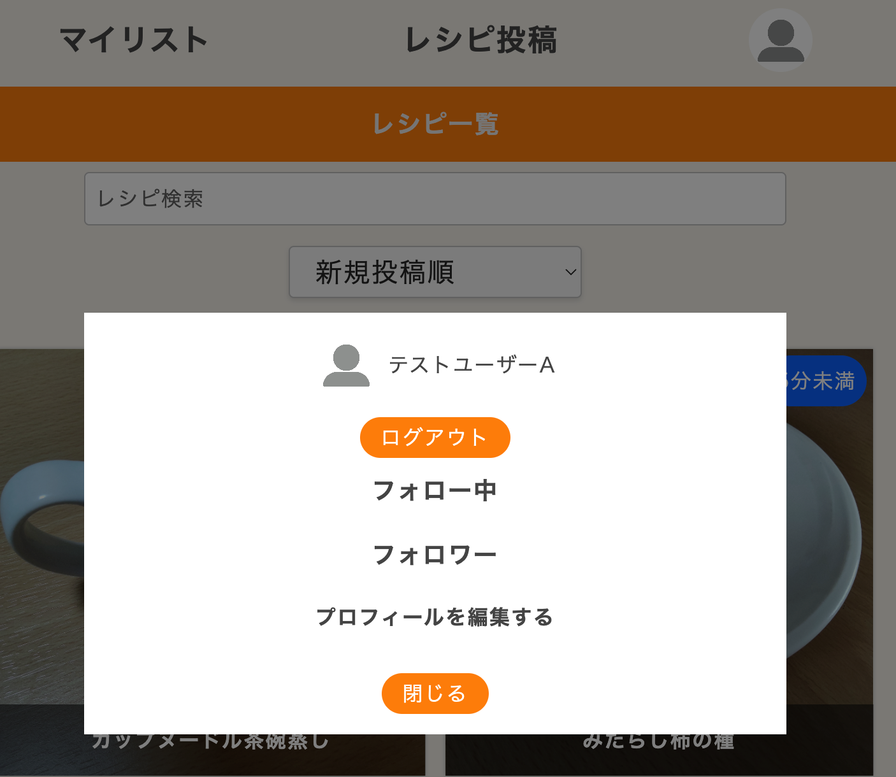

  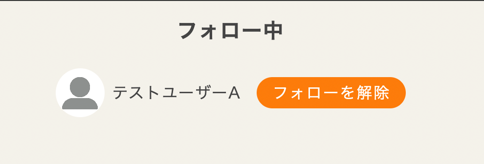

- **フォロワーの一覧**: 先のモーダルから、「フォロワー」という箇所をクリックすることで、自分をフォローしているユーザーの一覧を閲覧できます。ここから、フォロワーをフォローすることも解除することもできます。
  
  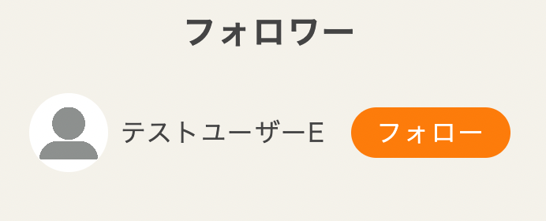

- **フォロー中のユーザー、あるいはフォロワーの情報**: 上記のフォロー中のユーザーとフォロワーのユーザーをクリックすると、そのユーザーの詳細画面(下の画像)に飛び、そのユーザーのレシピとフォロー中のユーザー、フォロワーの数が表示されます。また、レシピの詳細画面のアバターをクリックしても、同様の画面に遷移します。
  
  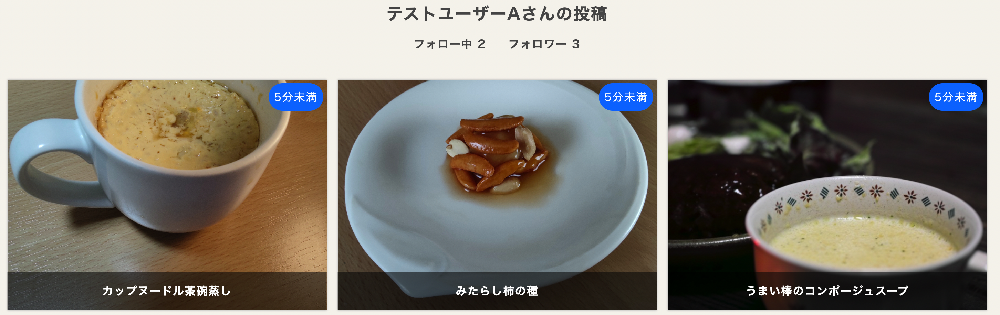

- **フォロー中のユーザー、あるいはフォロワーの詳細情報**: 上の画像の画面から、「フォロー中」、「フォロワー」のいずれかをクリックすると、そのユーザーのフォロー中、フォロワーの一覧が見られます。下記の画像は「フォロー中 2」をクリックした際の画面で、テストユーザーAのフォロー中のユーザーリストが表示されます。

  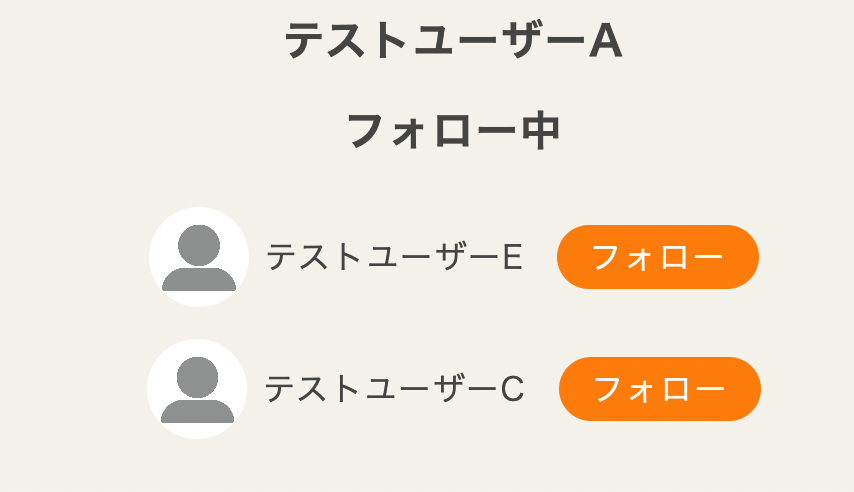

### お気に入り機能
- **レシピのマイリスト保存**: レシピ詳細画面で気に入ったレシピを「保存」ボタンを押すことで、マイリストに保存できます。
  
  

- **お気に入り解除**: 一度お気に入りに保存したレシピをマイリストから削除することが可能です。
  
  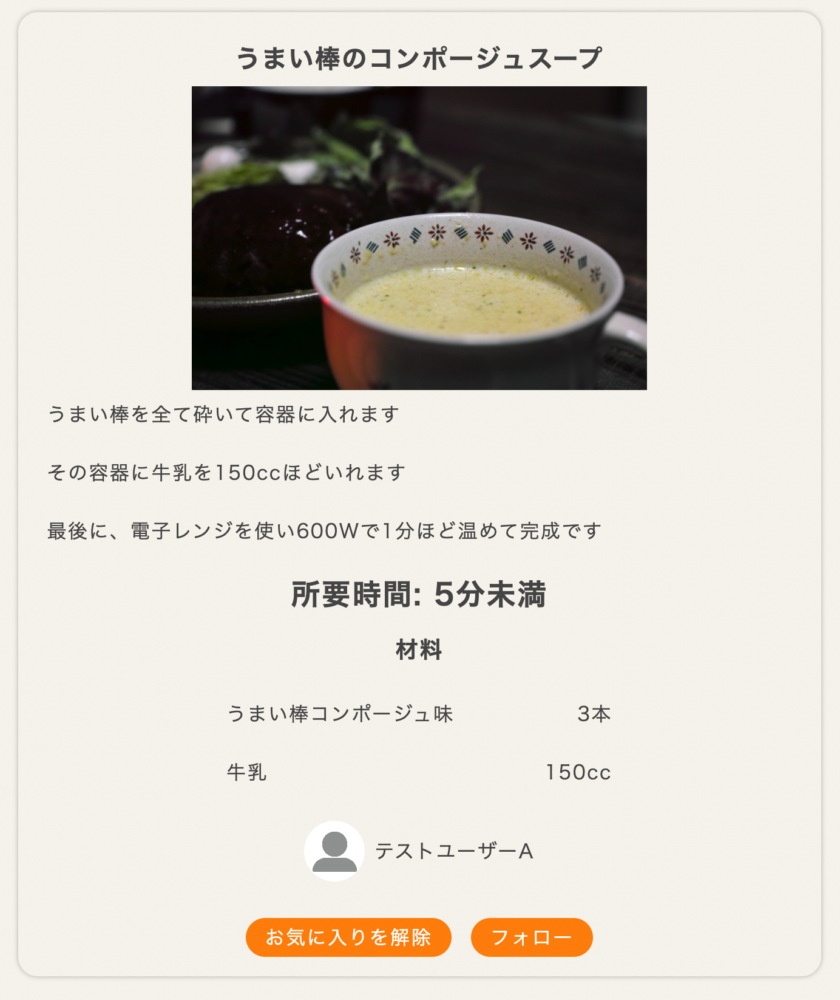

### プロフィール編集機能
- **プロフィールの編集**: ユーザーは自分のプロフィール画面で、ユーザー名やプロフィール画像を変更することができます。
  
  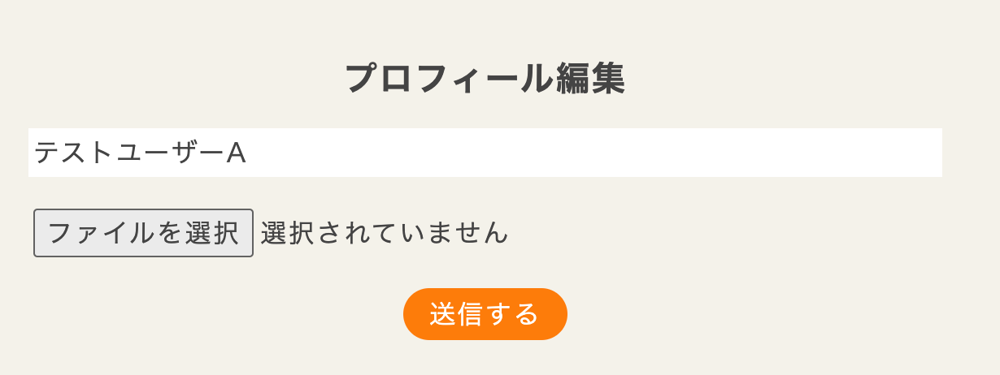

これらの機能により、ユーザーは自分の好みに合わせてレシピを管理したり、他のユーザーとの交流を深めたりすることができます。

### レシピの検索機能
- **レシピの検索**: ルートパスのinputタグに文字を入れると、レシピの検索が可能です。

  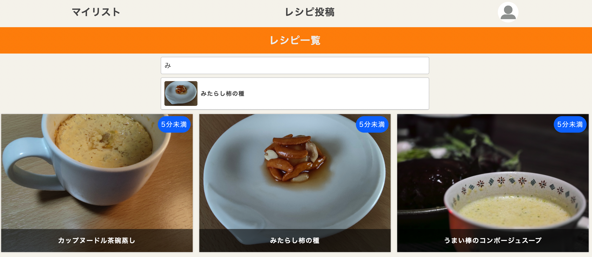

他にも、ルートパスで表示されているセレクトボックスから、レシピの所要時間の短い順にレシピを並び替えることもできます。

## インフラ
デプロイにはAWSを使用しており、フロントエンドのデプロイをするのに使ったサービスは

- S3　　ビルドしたファイルを保存するためのストレージとして利用
- CloudFront　　独自ドメインに対応し、コンテンツを高速に配信するために利用
- Route53　　独自ドメインを利用するために導入

これらの3つのサービスを使って、デプロイしました

## 使用したライブラリは以下の通り

- react-hook-form　　こちらのライブラリは非制御コンポーネントを採用しており、レンダリング回数が制御コンポーネントより抑えられる分、パフォーマンス的に優位であると思い、フォームの実装のために採用しました
- zod　　2024年9月時点で、yupやjoiといったバリデーションライブラリよりダウンロード数が多く、情報量も多いために採用しました
- js-cookie　　認証する際に、クッキーを使用するのに便利なので使用しました
- axios　　HTTP通信をする際に採用しました
- tanstack router　　ファイルベースのルーティングを行うために採用しました
- tanstack query　　APIからのデータをフェッチ、更新するために採用しました
- fuse.js　　レシピ投稿をあいまい検索するために採用しました
- browser-image-compression　　画像を圧縮するために使用(こちらのライブラリは、圧縮する際にWeb Workerを使用しており、画面操作がブロッキングされる恐れがないために採用しました)
- zustand　　他の状態管理ライブラリと比較してもバンドルサイズが小さく、定型コードが少ない点を魅力に感じ、採用しました

### テストには
- React Testing Library
- vitest　　jestと比較するとテストの実行速度がやや速いことなので採用しました
- msw　　モックサーバーとして採用しました

を使用しました

## 工夫した点

1. **コード分割を使用**
   コード分割を使用することによって、初期読み込みにかかる時間の削減が期待できます

2. **UXの向上のためにスケルトンスクリーンを採用**  
   ロード時間が長くなっても心理的に短く感じられるように、スケルトンスクリーンを使用しました。

3. **レシピの所要時間に応じた視覚的フィードバック**  
   レシピには `cooking_time` カラムを追加し、所要時間を選択できるようにしました。  
   - 5分未満、10分未満、20分未満、30分未満、30分以上の選択肢があり、各時間に応じて表示色が異なるため、詳細ページに移動せずに一目で調理時間が分かります。下記の画像のように、レシピの所要時間に応じて、右上の背景色が異なっていることがわかると思います(下記の画像の場合、5分未満の場合は青、10分未満の場合は緑、30分未満の場合はオレンジ色となっています)。

  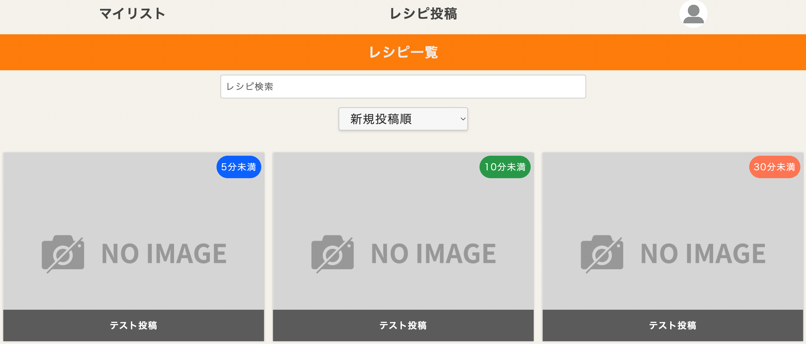

4. **GitHub Actionsを使用して、テスト、ビルド、デプロイの自動化**  
   - Pull Request時にテストを自動で実行。  
   - `main` ブランチへのプッシュ時に、自動でビルドしAWS S3へデプロイ。

5. **画像圧縮**  
   レシピ画像が表示される際のデータサイズを減らすため、画像を圧縮して(browser-image-compressionを使用)表示速度を改善しました。

   
## アプリを作成して、学んだ点

- 楽観的更新の導入検討

詳細ページにおいて、フォローボタンなどは、APIサーバへPostリクエストを送り、それが正常ならばフォロー解除ボタンへとUIが更新される状況です。
現時点では特に不便を感じることはないものの、サーバー側のレスポンスが遅延した場合、ボタンの状態がなかなか反映されず、ユーザーが操作に不安を感じる可能性があります。
そのため、将来的にサーバーのレスポンスタイムが増加する場合や、通信状況が悪い環境でも快適に使えるようにするために、楽観的更新を採用した方が良いかもと感じました。

- フォルダー構造の重要性

初期段階では、すべてのコンポーネントファイルを単一の components フォルダーに入れていました。しかし、このアプローチでは、コンポーネントファイルが増えるにつれて components フォルダー内が非常に多くのファイルで混雑し、エディタでの操作が煩雑になってしまいました。具体的には、ファイルを追加したり修正したりする際に、目的のファイルを探すのが困難でした。そこで、コンポーネントファイルを機能ごとにフォルダーで分けることにしました。これにより、例えば components/Authなど、関連するコンポーネントをグループ化することができ、フォルダー内が整理されました。この変更により、目的のコンポーネントファイルを迅速に見つけやすくなり、コードのメンテナンス性や開発効率が良くなったと感じています。このことから、フォルダー構造について考えることの重要性を実感しました。